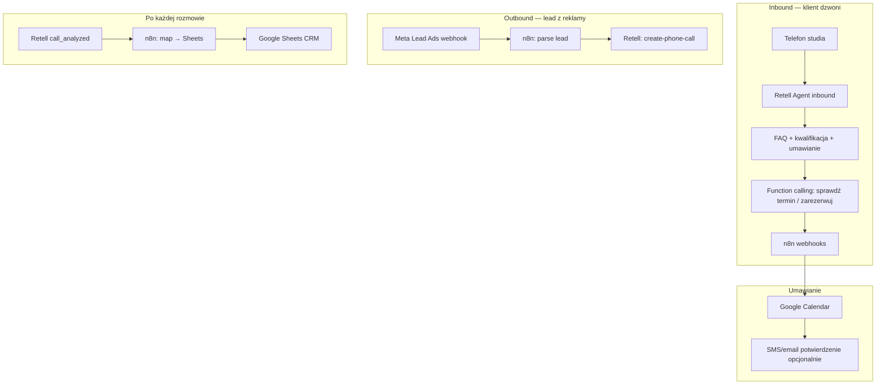

<!-- Generated by SpecStory, Markdown v2.1.0 -->

# 2026-08-14 14:25:23Z

<!-- Cursor IDE Session c35b84d0-89df-4af3-94e4-998af4dd419f (2026-08-14 14:25:23Z) -->

_**User**_

Musimy to rozbudować, trzeba zrobić obsługę klienta, ai ma odbierać telefony, odpowiadać na proste pytania, mają być spełnione warunki ze screenshota

---

_**Agent (composer-2.5)**_

<think><details><summary>Thought Process</summary>
Rozszerzam projekt o obsługę klienta. AI będzie odbierać telefony i odpowiadać na proste pytania. Spełnię wymagania ze screenshota.

Zidentyfikowałem szczegółowe wymagania ze screenshota. Rozwiązanie musi obsługiwać automatyczne rozmowy z leadami z reklam Facebook i Instagram. Odpowiadać po polsku na pytania FAQ. Kwalifikować leady w czasie rozmowy. Planować i potwierdzać spotkania. Integrować z kalendarzem oraz CRM i Meta Lead Ads. Wykorzystać Voice AI i automatykę n8n, Make lub Zapier. Uwzględnić istniejący projekt asystenta AI.

Przeglądam strukturę projektu i istniejące workflow'y. Chcę zrozumieć obecny kod przed dodaniem obsługi telefonów przychodzących.
</details></think>

_**Agent (composer-2.5)**_

Rozbudowujemy system o obsługę klienta zgodnie ze screenshotem. Najpierw przejrzę projekt i to, co już mamy.


_**Agent (composer-2.5)**_

<tool-use data-tool-type="unknown" data-tool-name="task_v2"><details>
<summary>Tool use: **task_v2**</summary>

Parameters:

```json
{
  "description": "Explore n8n project structure",
  "model": "composer-2.5-fast",
  "name": "explore",
  "prompt": "Explore the codebase at c:\\Users\\askik\\Desktop\\n8n_AI_assistant thoroughly. I need to understand:\n\n1. Project structure - what workflows exist, what voice AI providers are supported (Vapi, Retell, etc.)\n2. Current capabilities - outbound calls, webhooks, Google Sheets mapping, CRM integration\n3. What's missing for inbound customer service: answering calls, FAQ, lead qualification, scheduling, calendar, Meta Lead Ads\n4. Key files: workflows/*.json, code/*.ts, scripts/build-workflow.mjs, .env structure (don't read secrets, just variable names)\n5. README or docs if any\n\nReturn a structured summary with:\n- Current architecture\n- Existing workflows and what they do\n- Gaps vs requirements (Polish Voice AI consultant for training studio: inbound/outbound calls, FAQ, lead qual, scheduling, CRM, Meta leads)\n- Recommended implementation plan with specific files to create/modify",
  "subagentType": "explore"
}
```
Additional data:

```json
{
  "status": "success",
  "subagentComposerId": "a2fcf63c-1c2d-46d2-a99d-eb84a1255747",
  "terminationReason": "completed"
}
```
Result:

```json
{
  "agentId": "a2fcf63c-1c2d-46d2-a99d-eb84a1255747"
}
```
Status: **completed**

</details></tool-use>

_**Agent (composer-2.5)**_

<tool-use data-tool-type="read" data-tool-name="read_file_v2"><details>
<summary>Tool use: **read_file_v2** • Read file: c:\Users\askik\Desktop\n8n_AI_assistant\scripts\build-workflow.mjs</summary>

</details></tool-use>

_**Agent (composer-2.5)**_

<tool-use data-tool-type="search" data-tool-name="glob_file_search"><details>
<summary>Tool use: **glob_file_search** • Searched codebase "" • **421** results in **1** directory</summary>

Directory: **`c:\Users\askik\Desktop\n8n_AI_assistant`** (421 files)

| File |
|------|
| `../.\code\package.json` |
| `../.\scripts\e2e\webhooks.test.mjs` |
| `../.\scripts\e2e\helpers.mjs` |
| `../.\.specstory\history\2026-08-14_14-09-01Z-system-test-creation.md` |
| `../.\.specstory\statistics.json` |
| `../.\code\tests\parseMetaLead.test.ts` |
| `../.\code\tests\mapRetellToSheets.test.ts` |
| `../.\code\tsconfig.json` |
| `../.\code\node_modules\.package-lock.json` |
| `../.\code\package-lock.json` |
| `../.\code\node_modules\@types\node\web-globals\streams.d.ts` |
| `../.\code\node_modules\@types\node\web-globals\storage.d.ts` |
| `../.\code\node_modules\@types\node\web-globals\navigator.d.ts` |
| `../.\code\node_modules\@types\node\web-globals\fetch.d.ts` |
| `../.\code\node_modules\@types\node\web-globals\events.d.ts` |
| `../.\code\node_modules\@types\node\web-globals\domexception.d.ts` |
| `../.\code\node_modules\@types\node\web-globals\abortcontroller.d.ts` |
| `../.\code\node_modules\@types\node\ts5.6\index.d.ts` |
| `../.\code\node_modules\@types\node\ts5.6\globals.typedarray.d.ts` |
| `../.\code\node_modules\@types\node\ts5.6\buffer.buffer.d.ts` |
| `../.\code\node_modules\@types\node\timers\promises.d.ts` |
| `../.\code\node_modules\@types\node\stream\web.d.ts` |
| `../.\code\node_modules\@types\node\stream\promises.d.ts` |
| `../.\code\node_modules\@types\node\stream\consumers.d.ts` |
| `../.\code\node_modules\@types\node\readline\promises.d.ts` |
| `../.\code\node_modules\@types\node\fs\promises.d.ts` |
| `../.\code\node_modules\@types\node\dns\promises.d.ts` |
| `../.\code\node_modules\@types\node\compatibility\iterators.d.ts` |
| `../.\code\node_modules\@types\node\compatibility\indexable.d.ts` |
| `../.\code\node_modules\@types\node\compatibility\index.d.ts` |
| `../.\code\node_modules\@types\node\compatibility\disposable.d.ts` |
| `../.\code\node_modules\@types\node\assert\strict.d.ts` |
| `../.\code\node_modules\@types\node\zlib.d.ts` |
| `../.\code\node_modules\@types\node\worker_threads.d.ts` |
| `../.\code\node_modules\@types\node\wasi.d.ts` |
| `../.\code\node_modules\@types\node\vm.d.ts` |
| `../.\code\node_modules\@types\node\v8.d.ts` |
| `../.\code\node_modules\@types\node\util.d.ts` |
| `../.\code\node_modules\@types\node\url.d.ts` |
| `../.\code\node_modules\@types\node\tty.d.ts` |
| `../.\code\node_modules\@types\node\trace_events.d.ts` |
| `../.\code\node_modules\@types\node\tls.d.ts` |
| `../.\code\node_modules\@types\node\timers.d.ts` |
| `../.\code\node_modules\@types\node\test.d.ts` |
| `../.\code\node_modules\@types\node\string_decoder.d.ts` |
| `../.\code\node_modules\@types\node\stream.d.ts` |
| `../.\code\node_modules\@types\node\sqlite.d.ts` |
| `../.\code\node_modules\@types\node\sea.d.ts` |
| `../.\code\node_modules\@types\node\repl.d.ts` |
| `../.\code\node_modules\@types\node\readline.d.ts` |
| `../.\code\node_modules\@types\node\querystring.d.ts` |
| `../.\code\node_modules\@types\node\punycode.d.ts` |
| `../.\code\node_modules\@types\node\process.d.ts` |
| `../.\code\node_modules\@types\node\perf_hooks.d.ts` |
| `../.\code\node_modules\@types\node\path.d.ts` |
| `../.\code\node_modules\@types\node\package.json` |
| `../.\code\node_modules\@types\node\os.d.ts` |
| `../.\code\node_modules\@types\node\net.d.ts` |
| `../.\code\node_modules\@types\node\module.d.ts` |
| `../.\code\node_modules\@types\node\inspector.generated.d.ts` |
| `../.\code\node_modules\@types\node\inspector.d.ts` |
| `../.\code\node_modules\@types\node\index.d.ts` |
| `../.\code\node_modules\@types\node\https.d.ts` |
| `../.\code\node_modules\@types\node\http2.d.ts` |
| `../.\code\node_modules\@types\node\http.d.ts` |
| `../.\code\node_modules\@types\node\globals.typedarray.d.ts` |
| `../.\code\node_modules\@types\node\globals.d.ts` |
| `../.\code\node_modules\@types\node\fs.d.ts` |
| `../.\code\node_modules\@types\node\events.d.ts` |
| `../.\code\node_modules\@types\node\domain.d.ts` |
| `../.\code\node_modules\@types\node\dns.d.ts` |
| `../.\code\node_modules\@types\node\diagnostics_channel.d.ts` |
| `../.\code\node_modules\undici-types\websocket.d.ts` |
| `../.\code\node_modules\undici-types\webidl.d.ts` |
| `../.\code\node_modules\@types\node\dgram.d.ts` |
| `../.\code\node_modules\undici-types\util.d.ts` |
| `../.\code\node_modules\undici-types\retry-handler.d.ts` |
| `../.\code\node_modules\@types\node\crypto.d.ts` |
| `../.\code\node_modules\undici-types\retry-agent.d.ts` |
| `../.\code\node_modules\undici-types\readable.d.ts` |
| `../.\code\node_modules\undici-types\proxy-agent.d.ts` |
| `../.\code\node_modules\undici-types\pool.d.ts` |
| `../.\code\node_modules\undici-types\pool-stats.d.ts` |
| `../.\code\node_modules\undici-types\patch.d.ts` |
| `../.\code\node_modules\@types\node\constants.d.ts` |
| `../.\code\node_modules\undici-types\mock-pool.d.ts` |
| `../.\code\node_modules\@types\node\console.d.ts` |
| `../.\code\node_modules\undici-types\mock-interceptor.d.ts` |
| `../.\code\node_modules\undici-types\mock-errors.d.ts` |
| `../.\code\node_modules\undici-types\mock-client.d.ts` |
| `../.\code\node_modules\undici-types\mock-agent.d.ts` |
| `../.\code\node_modules\@types\node\cluster.d.ts` |
| `../.\code\node_modules\undici-types\interceptors.d.ts` |
| `../.\code\node_modules\undici-types\index.d.ts` |
| `../.\code\node_modules\@types\node\child_process.d.ts` |
| `../.\code\node_modules\undici-types\header.d.ts` |
| `../.\code\node_modules\undici-types\handlers.d.ts` |
| `../.\code\node_modules\undici-types\global-origin.d.ts` |
| `../.\code\node_modules\undici-types\global-dispatcher.d.ts` |
| `../.\code\node_modules\undici-types\formdata.d.ts` |
| `../.\code\node_modules\@types\node\buffer.d.ts` |
| `../.\code\node_modules\undici-types\filereader.d.ts` |
| `../.\code\node_modules\undici-types\file.d.ts` |
| `../.\code\node_modules\undici-types\fetch.d.ts` |
| `../.\code\node_modules\undici-types\eventsource.d.ts` |
| `../.\code\node_modules\@types\node\buffer.buffer.d.ts` |
| `../.\code\node_modules\undici-types\errors.d.ts` |
| `../.\code\node_modules\@types\node\async_hooks.d.ts` |
| `../.\code\node_modules\undici-types\env-http-proxy-agent.d.ts` |
| `../.\code\node_modules\undici-types\dispatcher.d.ts` |
| `../.\code\node_modules\undici-types\diagnostics-channel.d.ts` |
| `../.\code\node_modules\@types\node\assert.d.ts` |
| `../.\code\node_modules\undici-types\cookies.d.ts` |
| `../.\code\node_modules\undici-types\content-type.d.ts` |
| `../.\code\node_modules\undici-types\connector.d.ts` |
| `../.\code\node_modules\@types\node\README.md` |
| `../.\code\node_modules\@types\node\LICENSE` |
| `../.\code\node_modules\undici-types\client.d.ts` |
| `../.\code\node_modules\undici-types\cache.d.ts` |
| `../.\code\node_modules\undici-types\balanced-pool.d.ts` |
| `../.\code\node_modules\undici-types\api.d.ts` |
| `../.\code\node_modules\undici-types\agent.d.ts` |
| `../.\code\node_modules\undici-types\README.md` |
| `../.\code\node_modules\undici-types\package.json` |
| `../.\code\node_modules\undici-types\LICENSE` |
| `../.\code\node_modules\.bin\tsx` |
| `../.\code\node_modules\.bin\tsx.cmd` |
| `../.\code\node_modules\.bin\tsx.ps1` |
| `../.\code\node_modules\.bin\esbuild.ps1` |
| `../.\code\node_modules\.bin\esbuild.cmd` |
| `../.\code\node_modules\.bin\esbuild` |
| `../.\code\node_modules\@esbuild\win32-x64\README.md` |
| `../.\code\node_modules\@esbuild\win32-x64\package.json` |
| `../.\code\node_modules\tsx\dist\types-Cxp8y2TL.d.ts` |
| `../.\code\node_modules\tsx\dist\esm\api\index.d.mts` |
| `../.\code\node_modules\tsx\dist\cjs\api\index.d.mts` |
| `../.\code\node_modules\tsx\dist\temporary-directory-BDDVQOvU.mjs` |
| `../.\code\node_modules\tsx\dist\suppress-warnings.mjs` |
| `../.\code\node_modules\tsx\dist\require-CywAB2e6.mjs` |
| `../.\code\node_modules\tsx\dist\repl.mjs` |
| `../.\code\node_modules\tsx\dist\register-C9AniqUt.mjs` |
| `../.\code\node_modules\tsx\dist\register-C4vWVmug.mjs` |
| `../.\code\node_modules\tsx\dist\preflight.mjs` |
| `../.\code\node_modules\tsx\dist\patch-repl.mjs` |
| `../.\code\node_modules\tsx\dist\package-B13bX4zz.mjs` |
| `../.\code\node_modules\tsx\dist\node-features-JeyyvQz6.mjs` |
| `../.\code\node_modules\tsx\dist\loader.mjs` |
| `../.\code\node_modules\tsx\dist\lexer-DQCqS3nf.mjs` |
| `../.\code\node_modules\tsx\dist\esm\index.mjs` |
| `../.\code\node_modules\tsx\dist\esm\api\index.mjs` |
| `../.\code\node_modules\tsx\dist\cjs\index.mjs` |
| `../.\code\node_modules\tsx\dist\cjs\api\index.mjs` |
| `../.\code\node_modules\tsx\dist\index-gbaejti9.mjs` |
| `../.\code\node_modules\tsx\dist\index-DQtFPMc2.mjs` |
| `../.\code\node_modules\tsx\dist\client-D_mPDF5S.mjs` |
| `../.\code\node_modules\tsx\dist\get-pipe-path-_tAJyU_v.mjs` |
| `../.\code\node_modules\tsx\dist\cli.mjs` |
| `../.\code\node_modules\tsx\README.md` |
| `../.\code\node_modules\tsx\package.json` |
| `../.\code\node_modules\tsx\dist\esm\api\index.d.cts` |
| `../.\code\node_modules\tsx\dist\cjs\api\index.d.cts` |
| `../.\code\node_modules\tsx\dist\temporary-directory-B83uKxJF.cjs` |
| `../.\code\node_modules\tsx\dist\suppress-warnings.cjs` |
| `../.\code\node_modules\tsx\dist\require-DDxgG93A.cjs` |
| `../.\code\node_modules\tsx\dist\repl.cjs` |
| `../.\code\node_modules\tsx\dist\register-Ciecs-Zx.cjs` |
| `../.\code\node_modules\tsx\dist\register-C557imBs.cjs` |
| `../.\code\node_modules\tsx\dist\preflight.cjs` |
| `../.\code\node_modules\tsx\dist\patch-repl.cjs` |
| `../.\code\node_modules\tsx\dist\package-sd2gMcZx.cjs` |
| `../.\code\node_modules\tsx\dist\node-features-CEjg7cMX.cjs` |
| `../.\code\node_modules\tsx\dist\loader.cjs` |
| `../.\code\node_modules\tsx\dist\lexer-DgIbo0BU.cjs` |
| `../.\code\node_modules\tsx\dist\esm\index.cjs` |
| `../.\code\node_modules\tsx\dist\esm\api\index.cjs` |
| `../.\code\node_modules\tsx\dist\cjs\index.cjs` |
| `../.\code\node_modules\tsx\dist\cjs\api\index.cjs` |
| `../.\code\node_modules\esbuild\lib\main.d.ts` |
| `../.\code\node_modules\esbuild\README.md` |
| `../.\code\node_modules\tsx\dist\index-BWFBUo6r.cjs` |
| `../.\code\node_modules\tsx\dist\index-6kqi0x0U.cjs` |
| `../.\code\node_modules\esbuild\LICENSE.md` |
| `../.\code\node_modules\esbuild\package.json` |
| `../.\code\node_modules\esbuild\lib\main.js` |
| `../.\code\node_modules\tsx\dist\get-pipe-path-D4YM6rQt.cjs` |
| `../.\code\node_modules\tsx\dist\client-D3mGB526.cjs` |
| `../.\code\node_modules\tsx\dist\cli.cjs` |
| `../.\code\node_modules\esbuild\install.js` |
| `../.\code\node_modules\esbuild\bin\esbuild` |
| `../.\code\node_modules\tsx\LICENSE` |
| `../.\scripts\build-workflow.test.mjs` |
| `../.\workflows\vapi-outbound-agent.json` |
| `../.\scripts\build-workflow.mjs` |
| `../.\code\mapRetellToSheets.ts` |
| `../.\.specstory\history\2026-08-10_21-49-33Z-data-flow-alternatives.md` |
| `../.\scripts\test-retell-webhook.json` |
| `../.\code\types.ts` |
| `../.\scripts\_test-lead.json` |
| `../.\scripts\tunnel-watchdog.ps1` |
| `../.\.env` |
| `../.\scripts\sync-tunnel-url.ps1` |
| `../.\.env.example` |
| `../.\scripts\setup-named-tunnel.ps1` |
| `../.\scripts\_latest-call.json` |
| `../.\scripts\_q.sql` |
| `../.\.specstory\history\2026-08-12_12-03-13Z-aktualne-koszty-i-op.md` |
| `../.\scripts\replay-retell-calls.mjs` |
| `../.\scripts\_retell-list.json` |
| `../.\scripts\_exec191.txt` |
| `../.\scripts\_parse191.cjs` |
| `../.\scripts\_exec189.txt` |
| `../.\scripts\_parse-exec.cjs` |
| `../.\scripts\_parse-exec.mjs` |
| `../.\scripts\_exec188.txt` |
| `../.\scripts\_exec172.txt` |
| `../.\scripts\reload.ps1` |
| `../.\scripts\_exec170.txt` |
| `../.\scripts\_exec169.txt` |
| `../.\code\mapVapiToSheets.ts` |
| `../.\scripts\_exec168.txt` |
| `../.\scripts\_exec167.txt` |
| `../.\scripts\_exec166.txt` |
| `../.\scripts\_exec165.txt` |
| `../.\scripts\_clear-running.sql` |
| `../.\scripts\_exec162.txt` |
| `../.\.specstory\history\2026-08-11_11-37-02Z-przeciez-wys-a-em.md` |
| `../.\scripts\setup-google-sheets.ps1` |
| `../.\README.md` |
| `../.\.specstory\history\2026-08-09_09-27-25Z-polish-phone-number-setup.md` |
| `../.\.specstory\history\2026-08-08_20-13-23Z-bot-conversational-adjustments.md` |
| `../.\.git\logs\refs\remotes\origin\first-branch` |
| `../.\.git\refs\remotes\origin\first-branch` |
| `../.\.git\config` |
| `../.\.git\logs\refs\heads\first-branch` |
| `../.\.git\logs\HEAD` |
| `../.\.git\refs\heads\first-branch` |
| `../.\.git\objects\cb\cfced838b1bfd38018db559f8d0b7a642390df` |
| `../.\.git\COMMIT_EDITMSG` |
| `../.\.git\objects\85\9ea0d7363dd9611090f1d857027de12061652a` |
| `../.\.git\HEAD` |
| `../.\.specstory\history\2026-08-08_19-51-14Z-money-balance-difference.md` |
| `../.\.specstory\history\2026-08-07_16-28-16Z-project-implementation-pricing.md` |
| `../.\scripts\tunnel.log` |
| `../.\scripts\start-tunnel.ps1` |
| `../.\vapi\outbound-call-payload.json` |
| `../.\scripts\fix-n8n-stuck.ps1` |
| `../.\.specstory\history\2026-08-07_14-52-30Z-training-budget-and-scheduling.md` |
| `../.\scripts\test-vapi-webhook.json` |
| `../.\.git\logs\refs\remotes\origin\main` |
| `../.\.git\refs\remotes\origin\main` |
| `../.\.git\logs\refs\heads\main` |
| `../.\.git\refs\heads\main` |
| `../.\.git\objects\50\b50506a160c6482e482a6126c99f3109391a1c` |
| `../.\.git\objects\f7\0829e3ff4b17bdc15345b9a7b4cc2ea596997b` |
| `../.\.git\objects\bf\748744fd5ef67f78db8b3c4ed418f1dce40cb3` |
| `../.\.git\objects\95\3908e7300307564e995f6189d5fc88a6d926bc` |
| `../.\.git\info\exclude` |
| `../.\.git\hooks\update.sample` |
| `../.\.git\hooks\sendemail-validate.sample` |
| `../.\.git\hooks\push-to-checkout.sample` |
| `../.\.git\hooks\prepare-commit-msg.sample` |
| `../.\.git\hooks\pre-receive.sample` |
| `../.\.git\hooks\pre-rebase.sample` |
| `../.\.git\hooks\pre-push.sample` |
| `../.\.git\hooks\pre-merge-commit.sample` |
| `../.\.git\hooks\pre-commit.sample` |
| `../.\.git\hooks\pre-applypatch.sample` |
| `../.\.git\hooks\post-update.sample` |
| `../.\.git\hooks\fsmonitor-watchman.sample` |
| `../.\.git\hooks\commit-msg.sample` |
| `../.\.git\hooks\applypatch-msg.sample` |
| `../.\.git\description` |
| `../.\scripts\frappe-fix-field.py` |
| `../.\vapi\test-end-of-call.json` |
| `../.\scripts\frappe-setup.py` |
| `../.\.specstory\history\2026-08-04_21-18-55Z-automated-ai-voice-agent.md` |
| `../.\docker-compose.yml` |
| `../.\.gitignore` |
| `../.\code\node_modules\.bin\tsserver` |
| `../.\code\node_modules\.bin\tsserver.ps1` |
| `../.\code\node_modules\.bin\tsserver.cmd` |
| `../.\code\node_modules\.bin\tsc.cmd` |
| `../.\code\node_modules\.bin\tsc` |
| `../.\code\node_modules\.bin\tsc.ps1` |
| `../.\code\node_modules\typescript\ThirdPartyNoticeText.txt` |
| `../.\code\node_modules\typescript\LICENSE.txt` |
| `../.\code\node_modules\typescript\lib\typescript.d.ts` |
| `../.\code\node_modules\typescript\lib\tsserverlibrary.d.ts` |
| `../.\code\node_modules\typescript\lib\lib.webworker.iterable.d.ts` |
| `../.\code\node_modules\typescript\lib\lib.webworker.importscripts.d.ts` |
| `../.\code\node_modules\typescript\lib\lib.webworker.d.ts` |
| `../.\code\node_modules\typescript\lib\lib.webworker.asynciterable.d.ts` |
| `../.\code\node_modules\typescript\lib\lib.scripthost.d.ts` |
| `../.\code\node_modules\typescript\lib\lib.esnext.sharedmemory.d.ts` |
| `../.\code\node_modules\typescript\lib\lib.esnext.promise.d.ts` |
| `../.\code\node_modules\typescript\lib\lib.esnext.iterator.d.ts` |
| `../.\code\node_modules\typescript\lib\lib.esnext.intl.d.ts` |
| `../.\code\node_modules\typescript\lib\lib.esnext.full.d.ts` |
| `../.\code\node_modules\typescript\lib\lib.esnext.float16.d.ts` |
| `../.\code\node_modules\typescript\lib\lib.esnext.error.d.ts` |
| `../.\code\node_modules\typescript\lib\lib.esnext.disposable.d.ts` |
| `../.\code\node_modules\typescript\lib\lib.esnext.decorators.d.ts` |
| `../.\code\node_modules\typescript\lib\lib.esnext.d.ts` |
| `../.\code\node_modules\typescript\lib\lib.esnext.collection.d.ts` |
| `../.\code\node_modules\typescript\lib\lib.esnext.array.d.ts` |
| `../.\code\node_modules\typescript\lib\lib.es6.d.ts` |
| `../.\code\node_modules\typescript\lib\lib.es5.d.ts` |
| `../.\code\node_modules\typescript\lib\lib.es2024.string.d.ts` |
| `../.\code\node_modules\typescript\lib\lib.es2024.sharedmemory.d.ts` |
| `../.\code\node_modules\typescript\lib\lib.es2024.regexp.d.ts` |
| `../.\code\node_modules\typescript\lib\lib.es2024.promise.d.ts` |
| `../.\code\node_modules\typescript\lib\lib.es2024.object.d.ts` |
| `../.\code\node_modules\typescript\lib\lib.es2024.full.d.ts` |
| `../.\code\node_modules\typescript\lib\lib.es2024.d.ts` |
| `../.\code\node_modules\typescript\lib\lib.es2024.collection.d.ts` |
| `../.\code\node_modules\typescript\lib\lib.es2024.arraybuffer.d.ts` |
| `../.\code\node_modules\typescript\lib\lib.es2023.intl.d.ts` |
| `../.\code\node_modules\typescript\lib\lib.es2023.full.d.ts` |
| `../.\code\node_modules\typescript\lib\lib.es2023.d.ts` |
| `../.\code\node_modules\typescript\lib\lib.es2023.collection.d.ts` |
| `../.\code\node_modules\typescript\lib\lib.es2023.array.d.ts` |
| `../.\code\node_modules\typescript\lib\lib.es2022.string.d.ts` |
| `../.\code\node_modules\typescript\lib\lib.es2022.regexp.d.ts` |
| `../.\code\node_modules\typescript\lib\lib.es2022.object.d.ts` |
| `../.\code\node_modules\typescript\lib\lib.es2022.intl.d.ts` |
| `../.\code\node_modules\typescript\lib\lib.es2022.full.d.ts` |
| `../.\code\node_modules\typescript\lib\lib.es2022.error.d.ts` |
| `../.\code\node_modules\typescript\lib\lib.es2022.d.ts` |
| `../.\code\node_modules\typescript\lib\lib.es2022.array.d.ts` |
| `../.\code\node_modules\typescript\lib\lib.es2021.weakref.d.ts` |
| `../.\code\node_modules\typescript\lib\lib.es2021.string.d.ts` |
| `../.\code\node_modules\typescript\lib\lib.es2021.promise.d.ts` |
| `../.\code\node_modules\typescript\lib\lib.es2021.intl.d.ts` |
| `../.\code\node_modules\typescript\lib\lib.es2021.full.d.ts` |
| `../.\code\node_modules\typescript\lib\lib.es2021.d.ts` |
| `../.\code\node_modules\typescript\lib\lib.es2020.symbol.wellknown.d.ts` |
| `../.\code\node_modules\typescript\lib\lib.es2020.string.d.ts` |
| `../.\code\node_modules\typescript\lib\lib.es2020.sharedmemory.d.ts` |
| `../.\code\node_modules\typescript\lib\lib.es2020.promise.d.ts` |
| `../.\code\node_modules\typescript\lib\lib.es2020.number.d.ts` |
| `../.\code\node_modules\typescript\lib\lib.es2020.intl.d.ts` |
| `../.\code\node_modules\typescript\lib\lib.es2020.full.d.ts` |
| `../.\code\node_modules\typescript\lib\lib.es2020.date.d.ts` |
| `../.\code\node_modules\typescript\lib\lib.es2020.d.ts` |
| `../.\code\node_modules\typescript\lib\lib.es2020.bigint.d.ts` |
| `../.\code\node_modules\typescript\lib\lib.es2019.symbol.d.ts` |
| `../.\code\node_modules\typescript\lib\lib.es2019.string.d.ts` |
| `../.\code\node_modules\typescript\lib\lib.es2019.object.d.ts` |
| `../.\code\node_modules\typescript\lib\lib.es2019.intl.d.ts` |
| `../.\code\node_modules\typescript\lib\lib.es2019.full.d.ts` |
| `../.\code\node_modules\typescript\lib\lib.es2019.d.ts` |
| `../.\code\node_modules\typescript\lib\lib.es2019.array.d.ts` |
| `../.\code\node_modules\typescript\lib\lib.es2018.regexp.d.ts` |
| `../.\code\node_modules\typescript\lib\lib.es2018.promise.d.ts` |
| `../.\code\node_modules\typescript\lib\lib.es2018.intl.d.ts` |
| `../.\code\node_modules\typescript\lib\lib.es2018.full.d.ts` |
| `../.\code\node_modules\typescript\lib\lib.es2018.d.ts` |
| `../.\code\node_modules\typescript\lib\lib.es2018.asynciterable.d.ts` |
| `../.\code\node_modules\typescript\lib\lib.es2017.typedarrays.d.ts` |
| `../.\code\node_modules\typescript\lib\lib.es2017.string.d.ts` |
| `../.\code\node_modules\typescript\lib\lib.es2018.asyncgenerator.d.ts` |
| `../.\code\node_modules\typescript\lib\lib.es2017.sharedmemory.d.ts` |
| `../.\code\node_modules\typescript\lib\lib.es2017.object.d.ts` |
| `../.\code\node_modules\typescript\lib\lib.es2017.intl.d.ts` |
| `../.\code\node_modules\typescript\lib\lib.es2017.full.d.ts` |
| `../.\code\node_modules\typescript\lib\lib.es2017.date.d.ts` |
| `../.\code\node_modules\typescript\lib\lib.es2017.d.ts` |
| `../.\code\node_modules\typescript\lib\lib.es2017.arraybuffer.d.ts` |
| `../.\code\node_modules\typescript\lib\lib.es2016.intl.d.ts` |
| `../.\code\node_modules\typescript\lib\lib.es2016.full.d.ts` |
| `../.\code\node_modules\typescript\lib\lib.es2016.d.ts` |
| `../.\code\node_modules\typescript\lib\lib.es2016.array.include.d.ts` |
| `../.\code\node_modules\typescript\lib\lib.es2015.symbol.wellknown.d.ts` |
| `../.\code\node_modules\typescript\lib\lib.es2015.symbol.d.ts` |
| `../.\code\node_modules\typescript\lib\lib.es2015.reflect.d.ts` |
| `../.\code\node_modules\typescript\lib\lib.es2015.proxy.d.ts` |
| `../.\code\node_modules\typescript\lib\lib.es2015.promise.d.ts` |
| `../.\code\node_modules\typescript\lib\lib.es2015.iterable.d.ts` |
| `../.\code\node_modules\typescript\lib\lib.es2015.generator.d.ts` |
| `../.\code\node_modules\typescript\lib\lib.es2015.d.ts` |
| `../.\code\node_modules\typescript\lib\lib.es2015.core.d.ts` |
| `../.\code\node_modules\typescript\lib\lib.es2015.collection.d.ts` |
| `../.\code\node_modules\typescript\lib\lib.dom.iterable.d.ts` |
| `../.\code\node_modules\typescript\lib\lib.dom.d.ts` |
| `../.\code\node_modules\typescript\lib\lib.dom.asynciterable.d.ts` |
| `../.\code\node_modules\typescript\lib\lib.decorators.legacy.d.ts` |
| `../.\code\node_modules\typescript\lib\lib.decorators.d.ts` |
| `../.\code\node_modules\typescript\lib\lib.d.ts` |
| `../.\code\node_modules\typescript\SECURITY.md` |
| `../.\code\node_modules\typescript\README.md` |
| `../.\code\node_modules\typescript\lib\typesMap.json` |
| `../.\code\node_modules\typescript\package.json` |
| `../.\code\node_modules\typescript\lib\zh-tw\diagnosticMessages.generated.json` |
| `../.\code\node_modules\typescript\lib\zh-cn\diagnosticMessages.generated.json` |
| `../.\code\node_modules\typescript\lib\tr\diagnosticMessages.generated.json` |
| `../.\code\node_modules\typescript\lib\ru\diagnosticMessages.generated.json` |
| `../.\code\node_modules\typescript\lib\pt-br\diagnosticMessages.generated.json` |
| `../.\code\node_modules\typescript\lib\pl\diagnosticMessages.generated.json` |
| `../.\code\node_modules\typescript\lib\ko\diagnosticMessages.generated.json` |
| `../.\code\node_modules\typescript\lib\ja\diagnosticMessages.generated.json` |
| `../.\code\node_modules\typescript\lib\it\diagnosticMessages.generated.json` |
| `../.\code\node_modules\typescript\lib\fr\diagnosticMessages.generated.json` |
| `../.\code\node_modules\typescript\lib\es\diagnosticMessages.generated.json` |
| `../.\code\node_modules\typescript\lib\de\diagnosticMessages.generated.json` |
| `../.\code\node_modules\typescript\lib\cs\diagnosticMessages.generated.json` |
| `../.\code\node_modules\typescript\lib\watchGuard.js` |
| `../.\code\node_modules\typescript\lib\typingsInstaller.js` |
| `../.\code\node_modules\typescript\lib\typescript.js` |
| `../.\code\node_modules\typescript\lib\tsserverlibrary.js` |
| `../.\code\node_modules\typescript\lib\tsserver.js` |
| `../.\code\node_modules\typescript\lib\_typingsInstaller.js` |
| `../.\code\node_modules\typescript\lib\tsc.js` |
| `../.\code\node_modules\typescript\lib\_tsserver.js` |
| `../.\code\node_modules\typescript\lib\_tsc.js` |
| `../.\code\node_modules\typescript\bin\tsserver` |
| `../.\code\node_modules\typescript\bin\tsc` |
| `../.\code\parseMetaLead.ts` |
| `../.\.specstory\.project.json` |
| `../.\.vscode\settings.json` |
| `../.\.specstory\cli\config.toml` |
| `../.\.cursorindexingignore` |
</details></tool-use>

_**Agent (composer-2.5)**_

<think><details><summary>Thought Process</summary>
Zrozumiałem wymagania projektu.

Rozszerzenie obejmuje obsługę klienta przez AI. Trzeba dodać automatyczne przetwarzanie leadów z reklam Facebook i Instagram, polskie pytania, FAQ, kwalifikację leadów, planowanie spotkań i integrację z kalendarzem oraz CRM. Obecnie system obsługuje wyłącznie rozmowy wychodzące.

Przygotowuję szczegółowe zmiany w kodzie. Dodam obsługę rozmów przychodzących w mapRetellToSheets. Stworzę parser webhooków Meta Lead Ads. Rozszerzę też pola CRM.

Planuję wdrożyć harmonogramowanie spotkań przez kalendarz Google. Przygotuję plik FAQ dla bazy wiedzy Retell i dokument promptu agenta po polsku. W build-workflow.mjs dodam nowe strumienie: weryfikację leadów Meta Lead Ads oraz narzędzia rezerwacyjne. Zmienię też kolumny arkusza i użyję operacji upsert zamiast append. Przeglądam istniejący kod źródłowy.
</details></think>

_**Agent (composer-2.5)**_

Przeglądam kluczowe pliki, żeby zaplanować rozbudowę pod obsługę klienta.


_**Agent (composer-2.5)**_

<tool-use data-tool-type="read" data-tool-name="read_file_v2"><details>
<summary>Tool use: **read_file_v2** • Read file: c:\Users\askik\Desktop\n8n_AI_assistant\code\types.ts</summary>

</details></tool-use>

_**Agent (composer-2.5)**_

<tool-use data-tool-type="read" data-tool-name="read_file_v2"><details>
<summary>Tool use: **read_file_v2** • Read file: c:\Users\askik\Desktop\n8n_AI_assistant\code\mapRetellToSheets.ts</summary>

</details></tool-use>

_**Agent (composer-2.5)**_

<tool-use data-tool-type="read" data-tool-name="read_file_v2"><details>
<summary>Tool use: **read_file_v2** • Read file: c:\Users\askik\Desktop\n8n_AI_assistant\code\parseMetaLead.ts</summary>

</details></tool-use>

_**Agent (composer-2.5)**_

<tool-use data-tool-type="read" data-tool-name="read_file_v2"><details>
<summary>Tool use: **read_file_v2** • Read file: c:\Users\askik\Desktop\n8n_AI_assistant\.env.example</summary>

</details></tool-use>

_**Agent (composer-2.5)**_

<tool-use data-tool-type="read" data-tool-name="read_file_v2"><details>
<summary>Tool use: **read_file_v2** • Read file: c:\Users\askik\Desktop\n8n_AI_assistant\code\tests\mapRetellToSheets.test.ts</summary>

</details></tool-use>

_**Agent (composer-2.5)**_

<think><details><summary>Thought Process</summary>
Zrozumiałem wymagania. Przystępuję do rozbudowy systemu o obsługę klienta i odbiór telefonów.

Planuję siedem zmian. Rozszerzę typy o pola leadu i kierunek rozmowy. Dodam parsowanie webhooków Meta Lead Ads z weryfikacją GET. Zaimplementuję logikę rezerwacji spotkania. Przygotuję FAQ i prompt agenta w języku polskim. Zaktualizuję też workflow budowania.

Dodam endpointy webhooków dla sprawdzania dostępności i rezerwacji spotkań. Rozszerzę kolumny arkusza i logikę upsertu po numerze telefonu. Zaktualizuję plik .env.example o zmienne Meta i kalendarza oraz przygotuję testy dla nowych modułów.
</details></think>

_**Agent (composer-2.5)**_

<tool-use data-tool-type="read" data-tool-name="read_file_v2"><details>
<summary>Tool use: **read_file_v2** • Read file: c:\Users\askik\Desktop\n8n_AI_assistant\scripts\test-retell-webhook.json</summary>

</details></tool-use>

_**Agent (composer-2.5)**_

<tool-use data-tool-type="read" data-tool-name="read_file_v2"><details>
<summary>Tool use: **read_file_v2** • Read file: c:\Users\askik\Desktop\n8n_AI_assistant\code\package.json</summary>

</details></tool-use>

_**Agent (composer-2.5)**_

<tool-use data-tool-type="read" data-tool-name="read_file_v2"><details>
<summary>Tool use: **read_file_v2** • Read file: c:\Users\askik\Desktop\n8n_AI_assistant\scripts\build-workflow.test.mjs</summary>

</details></tool-use>

_**Agent (composer-2.5)**_

<tool-use data-tool-type="search" data-tool-name="glob_file_search"><details>
<summary>Tool use: **glob_file_search** • Searched codebase "" • **2** results in **1** directory</summary>

Directory: **`c:\Users\askik\Desktop\n8n_AI_assistant`** (2 files)

| File |
|------|
| `../.\scripts\test-retell-webhook.json` |
| `../.\scripts\test-vapi-webhook.json` |
</details></tool-use>

_**Agent (composer-2.5)**_

<think><details><summary>Thought Process</summary>
Przystępuję do wdrożenia pełnej obsługi klienta z obsługą telefoniczną i odpowiedziami AI.

Rozszerzam typy o pola kierunku, źródła, oceny leadu, budżetu, zaplanowanego slotu i metadanych. Ulepszę mapowanie Retell do Sheets. Dodam nowy parser dla webhooków Meta.

Dodaję moduł retellScheduling.ts do parsowania polskich dat i rezerwacji spotkania w Google Calendar przez API n8n. Rozszerzam build-workflow.mjs o nowe przepływy, w tym weryfikację webhooków GET.

Dodaję przepływy B, C i D w build-workflow.mjs. Flow B zapisuje analizę rozmowy Retell do Sheets. Flow C obsługuje sprawdzanie dostępności slotów. Flow D obsługuje rezerwację spotkania.

Dla prawdziwych webhooków Meta przygotowuję parser parseMetaLeadWebhook.ts. Obsłuży on weryfikację GET z tokenem oraz powiadomienia o zmianach leadgen. Pobiorę szczegółowe dane leadu z Graph API.

Struktura webhooku Meta zawiera ad_id, form_id, leadgen_id oraz created_time. Szczegóły leadu pobiorę z Graph API pod adresem /{leadgen_id} z polami
</details></think>

_**Agent (composer-2.5)**_

Implementuję rozbudowę: inbound, Meta Lead Ads, kwalifikacja leadów, rezerwacje i FAQ.


_**Agent (composer-2.5)**_

<tool-use data-tool-type="unknown" data-tool-name="todo_write"><details>
<summary>Tool use: **todo_write**</summary>

Parameters:

```json
{
  "merge": true
}
```
Result:

```json
{
  "finalTodos": [
    {
      "content": "Rozszerzyć types.ts i mapRetellToSheets.ts (inbound, kwalifikacja, CRM)",
      "id": "1",
      "status": "in_progress"
    },
    {
      "content": "Dodać parseMetaLeadWebhook.ts + retellScheduling.ts + FAQ",
      "id": "2",
      "status": "pending"
    },
    {
      "content": "Rozbudować build-workflow.mjs (Meta webhook, scheduling, upsert)",
      "id": "3",
      "status": "pending"
    },
    {
      "content": "Testy, .env.example, prompt Retell, rebuild workflow",
      "id": "4",
      "status": "pending"
    }
  ],
  "success": true
}
```
Status: **completed**

</details></tool-use>

_**Agent (composer-2.5)**_

<tool-use data-tool-type="read" data-tool-name="read_file_v2"><details>
<summary>Tool use: **read_file_v2** • Read file: c:\Users\askik\Desktop\n8n_AI_assistant\code\tests\parseMetaLead.test.ts</summary>

</details></tool-use>

_**Agent (composer-2.5)**_

<think><details><summary>Thought Process</summary>
Sprawdzam plik _test-lead.json oraz synchronizuję parseMetaLead.ts z build-workflow. W build-workflow numer +48 jest opcjonalny, a kampania wymagana. W parseMetaLead.ts numer +1 jest wymagany, a kampania opcjonalna.

Zaktualizuję parseMetaLead.ts zgodnie z build-workflow. Teraz napiszę wszystkie pliki.
</details></think>

_**Agent (composer-2.5)**_

<tool-use data-tool-type="write" data-tool-name="edit_file_v2"><details>
<summary>Tool use: **edit_file_v2** • Edit file: c:\Users\askik\Desktop\n8n_AI_assistant\code\types.ts</summary>

</details></tool-use>

_**Agent (composer-2.5)**_

<tool-use data-tool-type="write" data-tool-name="edit_file_v2"><details>
<summary>Tool use: **edit_file_v2**</summary>
Cancelled
</details></tool-use>

---

_**User**_

Poczekaj, co chcesz wprowadzić, napisz mi wpierw

---

_**Agent (composer-2.5)**_

<think><details><summary>Thought Process</summary>
Użytkownik prosi o opisanie planowanych zmian przed ich wdrożeniem.

Przygotowuję teraz szczegółowy plan w języku polskim na podstawie przeprowadzonej analizy i wymagań ze zrzutu ekranu.
</details></think>

_**Agent (composer-2.5)**_

Plan rozbudowy — do akceptacji przed kodem

Przeanalizowałem projekt i wymagania ze screenshota (Voice AI + CRM dla studia treningowego). Poniżej co **już działa**, czego **brakuje** i co proponuję **dodać**.

---

## Co masz teraz

Obecny pipeline to **outbound**:

```
Meta Lead (symulowany webhook) → Retell (automatyczny telefon) → Google Sheets (log po rozmowie)
```

Działa:
- automatyczne dzwonienie do leadów z formularza
- logowanie rozmów do Google Sheets (status, transkrypt, preferowany termin)
- obsługa języka polskiego (statusy, godziny „o ósmej” → „o 8”)
- Retell jako platforma Voice AI

Nie działa jeszcze (albo tylko częściowo):
- **odbieranie** przychodzących telefonów (inbound)
- **FAQ** w repo (to jest w promptcie agenta Retell, nie w kodzie)
- **prawdziwy** webhook Meta Lead Ads (teraz to ręczny POST testowy)
- **rezerwacja w kalendarzu** (tylko tekst „preferred_session_date”, bez Google Calendar)
- **CRM** poza prostym logiem w Sheets (brak upsert, duplikaty przy powtórnych rozmowach)

---

## Wymagania ze screenshota — mapowanie

| Wymaganie | Stan | Co trzeba zrobić |
|-----------|------|------------------|
| Odbieranie telefonów + oddzwanianie do leadów z FB/IG | Częściowo | Outbound jest; inbound w Retell + logowanie w n8n |
| Rozmowy po polsku | OK | Prompt agenta Retell (poza repo) |
| Odpowiedzi na FAQ | Brak | Baza wiedzy + prompt agenta |
| Kwalifikacja leadów | Częściowo | Pola w post-call analysis Retell |
| Umawianie treningów próbnych | Częściowo | Function calling → n8n → kalendarz |
| Kalendarz + potwierdzenia | Brak | Google Calendar API |
| Integracja CRM + Meta Lead Ads | Częściowo | Prawdziwy webhook Meta + lepszy Sheets/CRM |

---

## Proponowana architektura (docelowa)



---

## Co konkretnie chciałem wprowadzić (fazy)

### Faza 1 — Inbound + lepszy CRM (n8n + Sheets)
**Pliki:** `code/mapRetellToSheets.ts`, `code/types.ts`, `scripts/build-workflow.mjs`

- Nowe kolumny w Sheets: `direction` (inbound/outbound), `source`, `lead_score`, `budget`, `booked_slot`, `meta_leadgen_id`
- **Upsert po numerze telefonu** zamiast append (bez duplikatów)
- Rozróżnienie rozmów przychodzących vs wychodzących w mapperze

**Retell (poza repo):** osobny agent inbound na numer studia z promptem obsługi klienta.

---

### Faza 2 — Meta Lead Ads (prawdziwa integracja)
**Pliki:** nowy `code/parseMetaLeadWebhook.ts`, rozszerzenie workflow

- Weryfikacja webhooka Meta (GET z `hub.verify_token`)
- Odbiór POST z `leadgen_id`
- Pobranie danych leada z Graph API (`full_name`, `phone_number`)
- Automatyczne oddzwonienie przez Retell (jak teraz, ale z prawdziwymi leadami)

**Nowe zmienne `.env`:** `META_VERIFY_TOKEN`, `META_ACCESS_TOKEN`, `META_APP_SECRET`, `META_PAGE_ID`

---

### Faza 3 — FAQ + kwalifikacja (głównie Retell)
**Pliki:** `data/faq-pl.json`, `docs/retell-agent-prompt.md`

- FAQ po polsku: ceny, godziny, lokalizacja, trening próbny, anulowanie
- Skrypt kwalifikacji w prompcie: cel, doświadczenie, budżet, dostępność
- Pola w post-call analysis Retell: `outcome`, `sessions_per_week`, `preferred_session_date`, `budget`, `goal`, `experience_level`

Logika rozmowy jest w **Retell**; n8n tylko zapisuje wyniki.

---

### Faza 4 — Umawianie + kalendarz
**Pliki:** nowy `code/retellScheduling.ts`, nowe webhooki w workflow

- `POST /webhook/retell-check-availability` — wolne terminy (np. pn–pt 8–20)
- `POST /webhook/retell-book-appointment` — rezerwacja w Google Calendar
- Retell woła te endpointy jako custom functions podczas rozmowy

**Nowe zmienne `.env`:** `GOOGLE_CALENDAR_ID`, `STUDIO_TIMEZONE`, `BOOKING_DURATION_MINUTES`

---

### Faza 5 — Porządki
- Aktualizacja README (Retell zamiast Vapi)
- Testy jednostkowe dla nowych modułów
- Ewentualnie przeniesienie legacy Vapi do `legacy/`

---

## Co NIE robi n8n (Retell dashboard)

| Element | Gdzie |
|---------|--------|
| Głos, język polski, naturalna rozmowa | Retell Agent |
| FAQ, skrypt rozmowy | Prompt + Knowledge Base Retell |
| Odbieranie inbound | Numer przypisany do agenta w Retell |
| Kwalifikacja „na żywo” | Prompt + function calling |
| Analiza po rozmowie | Retell Post-Call Analysis |

n8n = **automatyka**: webhooki, dzwonienie, kalendarz, CRM.

---

## Propozycja MVP (minimum na start)

Jeśli chcesz iść etapami:

1. **Agent inbound w Retell** + rozszerzony mapper (kierunek, źródło, upsert) — ~1–2 dni  
2. **Prawdziwy webhook Meta** — automatyczne oddzwanianie — ~2 dni  
3. **FAQ + prompt** — dokument + konfiguracja Retell — ~1 dzień  
4. **Google Calendar booking** — function calling — ~3 dni  

---

## Pytania do Ciebie

Zanim cokolwiek wdrożę:

1. **Retell** — masz już agenta inbound na numerze studia, czy trzeba go skonfigurować od zera?
2. **Meta Lead Ads** — masz Page + formularz leadów i dostęp do Graph API?
3. **Kalendarz** — Google Calendar OK, czy inny (Cal.com, Outlook)?
4. **CRM** — zostajemy przy Google Sheets, czy HubSpot / Pipedrive / coś innego?
5. **Priorytet** — co najpierw: inbound, Meta, czy kalendarz?

Napisz, które fazy akceptujesz i od czego zacząć — wtedy wdrożę tylko to, co ustalimy.
