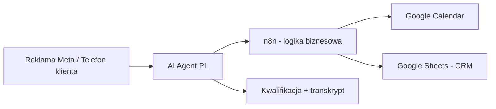

<!-- Generated by SpecStory, Markdown v2.1.0 -->

# 2026-08-17 13:23:19Z

<!-- Cursor IDE Session a627c186-11f5-47f3-8fed-363a0a1f81a6 (2026-08-17 13:23:19Z) -->

_**User**_

Chciałbym ten projekt jakoś zmontować profesjonalnie, z głosem ai i fajnymi przejściami, jak to najszybciej zrobić i jak patrząc na ten projekt, jakbyś go zaprezentował jakbyś miał go sprzedać 

---

_**Agent (composer-2.5)**_

<think><details><summary>Thought Process</summary>
Użytkownik pyta po polsku o szybkie i profesjonalne przygotowanie projektu z głosem AI i przejściami. Chce też wiedzieć, jak bym go zaprezentował lub sprzedawał.

Zacznę od analizy struktury projektu i jego dokumentacji. Potem przedstawię szybkie sposoby na profesjonalną prezentację z głosem AI oraz skuteczny pitch.
</details></think>

_**Agent (composer-2.5)**_

Najpierw przejrzę strukturę projektu i kluczowe pliki, żeby zrozumieć, co dokładnie robi — na tej podstawie zaproponuję szybki sposób montażu z głosem AI i scenariusz prezentacji sprzedażowej.


_**Agent (composer-2.5)**_

<tool-use data-tool-type="search" data-tool-name="glob_file_search"><details>
<summary>Tool use: **glob_file_search** • Searched codebase "" • **36** results in **1** directory</summary>

Directory: **`c:\Users\askik\Desktop\n8n_AI_assistant`** (36 files)

| File |
|------|
| `../docs\retell-custom-functions.json` |
| `../.specstory/history/2026-08-07_14-52-30Z-training-budget-and-scheduling.md` |
| `../.specstory/history/2026-08-10_21-49-33Z-data-flow-alternatives.md` |
| `../docs/retell-agent-prompt.md` |
| `../scripts/test-retell-check-availability.json` |
| `../.specstory/.project.json` |
| `../.specstory/history/2026-08-14_14-09-01Z-system-test-creation.md` |
| `../code/package-lock.json` |
| `../.specstory/history/2026-08-04_21-18-55Z-automated-ai-voice-agent.md` |
| `../data/faq-pl.json` |
| `../vapi/outbound-call-payload.json` |
| `../README.md` |
| `../scripts/_retell-list.json` |
| `../.vscode/settings.json` |
| `../docs\retell-agent-prompt.md` |
| `../.specstory/history/2026-08-09_09-27-25Z-polish-phone-number-setup.md` |
| `../.vscode\settings.json` |
| `../.specstory/history/2026-08-14_14-25-23Z-ai-customer-service-expansion.md` |
| `../scripts/test-retell-webhook.json` |
| `../.specstory/history/2026-08-14_14-37-05Z-n8n-ai-assistant-exploration.md` |
| `../.specstory/statistics.json` |
| `../scripts/test-vapi-webhook.json` |
| `../workflows/vapi-outbound-agent.json` |
| `../.specstory/history/2026-08-12_12-03-13Z-aktualne-koszty-i-op.md` |
| `../.specstory/history/2026-08-07_16-28-16Z-project-implementation-pricing.md` |
| `../.specstory/history/2026-08-14_16-51-52Z-mapi-project-overview.md` |
| `../vapi/test-end-of-call.json` |
| `../.specstory/history/2026-08-08_19-51-14Z-money-balance-difference.md` |
| `../code/tsconfig.json` |
| `../code/package.json` |
| `../scripts/_test-lead.json` |
| `../.specstory/history/2026-08-11_11-37-02Z-przeciez-wys-a-em.md` |
| `../docs/retell-custom-functions.json` |
| `../scripts/_latest-call.json` |
| `../.specstory/history/2026-08-08_20-13-23Z-bot-conversational-adjustments.md` |
| `../scripts/test-retell-book-appointment.json` |
</details></tool-use>

_**Agent (composer-2.5)**_

<tool-use data-tool-type="read" data-tool-name="read_file_v2"><details>
<summary>Tool use: **read_file_v2** • Read file: c:\Users\askik\Desktop\n8n_AI_assistant\docs\retell-agent-prompt.md</summary>

</details></tool-use>

_**Agent (composer-2.5)**_

<tool-use data-tool-type="unknown" data-tool-name="ripgrep_raw_search"><details>
<summary>Tool use: **ripgrep_raw_search**</summary>

Parameters:

```json
{
  "caseInsensitive": false,
  "glob": "*",
  "outputMode": "files_with_matches",
  "pattern": "README"
}
```
Additional data:

```json
{
  "isPruned": true,
  "outputMode": "files_with_matches",
  "pattern": "README",
  "topFiles": [
    {
      "matchCount": 1,
      "uri": ".specstory/history/2026-08-14_14-37-05Z-n8n-ai-assistant-exploration.md"
    },
    {
      "matchCount": 1,
      "uri": ".specstory/history/2026-08-14_16-51-52Z-mapi-project-overview.md"
    },
    {
      "matchCount": 1,
      "uri": ".specstory/history/2026-08-08_19-51-14Z-money-balance-difference.md"
    },
    {
      "matchCount": 1,
      "uri": ".specstory/history/2026-08-11_11-37-02Z-przeciez-wys-a-em.md"
    },
    {
      "matchCount": 1,
      "uri": ".specstory/history/2026-08-14_14-09-01Z-system-test-creation.md"
    },
    {
      "matchCount": 1,
      "uri": ".specstory/history/2026-08-08_20-13-23Z-bot-conversational-adjustments.md"
    },
    {
      "matchCount": 1,
      "uri": ".specstory/history/2026-08-10_21-49-33Z-data-flow-alternatives.md"
    },
    {
      "matchCount": 1,
      "uri": ".specstory/history/2026-08-12_12-03-13Z-aktualne-koszty-i-op.md"
    },
    {
      "matchCount": 1,
      "uri": ".specstory/history/2026-08-14_14-25-23Z-ai-customer-service-expansion.md"
    },
    {
      "matchCount": 1,
      "uri": ".specstory/history/2026-08-09_09-27-25Z-polish-phone-number-setup.md"
    },
    {
      "matchCount": 1,
      "uri": ".specstory/history/2026-08-07_14-52-30Z-training-budget-and-scheduling.md"
    },
    {
      "matchCount": 1,
      "uri": ".specstory/history/2026-08-07_16-28-16Z-project-implementation-pricing.md"
    },
    {
      "matchCount": 1,
      "uri": ".specstory/history/2026-08-04_21-18-55Z-automated-ai-voice-agent.md"
    },
    {
      "matchCount": 1,
      "uri": "code/types.ts"
    }
  ],
  "totalFiles": 14,
  "totalMatches": 14
}
```
Status: **completed**

</details></tool-use>

_**Agent (composer-2.5)**_

<think><details><summary>Thought Process</summary>
Przeglądam dokumentację projektu, by przygotować profesjonalną prezentację.
</details></think>

_**Agent (composer-2.5)**_

<tool-use data-tool-type="read" data-tool-name="read_file_v2"><details>
<summary>Tool use: **read_file_v2** • Read file: c:\Users\askik\Desktop\n8n_AI_assistant\README.md</summary>

</details></tool-use>

_**Agent (composer-2.5)**_

<tool-use data-tool-type="read" data-tool-name="read_file_v2"><details>
<summary>Tool use: **read_file_v2** • Read file: c:\Users\askik\Desktop\n8n_AI_assistant\.specstory\history\2026-08-14_16-51-52Z-mapi-project-overview.md</summary>

</details></tool-use>

_**Agent (composer-2.5)**_

<tool-use data-tool-type="read" data-tool-name="read_file_v2"><details>
<summary>Tool use: **read_file_v2** • Read file: c:\Users\askik\Desktop\n8n_AI_assistant\.specstory\history\2026-08-12_12-03-13Z-aktualne-koszty-i-op.md</summary>

</details></tool-use>

_**Agent (composer-2.5)**_

<think><details><summary>Thought Process</summary>
Uzupełniam informacje o cenniku i funkcjach Retell, by przygotować pełną prezentację.
</details></think>

_**Agent (composer-2.5)**_

<tool-use data-tool-type="read" data-tool-name="read_file_v2"><details>
<summary>Tool use: **read_file_v2** • Read file: c:\Users\askik\Desktop\n8n_AI_assistant\.specstory\history\2026-08-07_16-28-16Z-project-implementation-pricing.md</summary>

</details></tool-use>

_**Agent (composer-2.5)**_

<tool-use data-tool-type="read" data-tool-name="read_file_v2"><details>
<summary>Tool use: **read_file_v2** • Read file: c:\Users\askik\Desktop\n8n_AI_assistant\data\faq-pl.json</summary>

</details></tool-use>

_**Agent (composer-2.5)**_

<tool-use data-tool-type="unknown" data-tool-name="ripgrep_raw_search"><details>
<summary>Tool use: **ripgrep_raw_search**</summary>

Parameters:

```json
{
  "caseInsensitive": false,
  "glob": "README.md",
  "path": "c:\\Users\\askik\\Desktop\\n8n_AI_assistant",
  "pattern": "Retell|inbound|Google Calendar"
}
```
Additional data:

```json
{
  "isPruned": true,
  "outputMode": "content",
  "path": "c:\\Users\\askik\\Desktop\\n8n_AI_assistant",
  "pattern": "Retell|inbound|Google Calendar",
  "topFiles": [
    {
      "matchCount": 3,
      "uri": "README.md"
    }
  ],
  "totalFiles": 1,
  "totalMatches": 3
}
```
Status: **completed**

</details></tool-use>

_**Agent (composer-2.5)**_

<think><details><summary>Thought Process</summary>
Zrozumiałem projekt.

Projekt to dwuetapowy system Vapi.ai i n8n. Outbound wysyła automatyczne rozmowy do leadów z Meta. Inbound to polska recepcja Retell w studiu fitness. Oba moduły łączą się z Google Sheets i kalendarzem.

Przygotowuję szybką instrukcję montażu prezentacji z AI-głosem i przejściami. Opiszę workflow dla CapCut lub Descript, strukturę demo, scenariusz wideo oraz pozycjonowanie cenowe. Nie będzie tu kodu, tylko praktyczne wskazówki.
</details></think>

_**Agent (composer-2.5)**_

## Najszybsza droga do profesjonalnego wideo (2–4 godziny)

Nie montuj tego jak filmu dokumentalnego. Zrób **demo sprzedażowe 90–120 sekund** — to wystarczy na LinkedIn, stronę ofertową i rozmowę z klientem.

### Stack, który działa najszybciej

| Etap | Narzędzie | Czas |
|------|-----------|------|
| Nagranie ekranu | **OBS** (darmowy) lub **Loom** | 30 min |
| Głos AI po polsku | **ElevenLabs** albo **CapCut → Text to Speech** | 15 min |
| Montaż + przejścia | **CapCut Desktop** (darmowy, gotowe presety) | 45–60 min |
| Napisy PL | CapCut auto-subtitles | 5 min |
| Muzyka tła | CapCut library (soft corporate / ambient) | 2 min |

**Alternatywa „jednym kliknięciem”:** **Descript** — wklejasz scenariusz, generuje głos, montujesz cięciem tekstu. Droższe, ale najszybsze jeśli nie lubisz montażu.

### Prosty workflow

1. **Napisz scenariusz** (poniżej masz gotowy — 90 s).
2. **Nagraj 4 klipy ekranu** (po 15–25 s każdy), bez dźwięku:
   - Meta Lead / formularz → webhook n8n
   - n8n workflow (animacja przepływu)
   - **Retell dashboard** — rozmowa inbound (najlepiej nagranie z telefonu albo symulacja)
   - Google Sheets / Calendar — nowy wiersz + rezerwacja
3. **Wygeneruj głos** w ElevenLabs (polski, ciepły, kobiecy lub męski — pasuje do recepcji studia).
4. **W CapCut:** wrzuć klipy → dopasuj do audio → dodaj **Cross Dissolve** lub preset „Smooth Zoom” między scenami → napisy → muzyka −20 dB pod głosem.
5. **Eksport:** 1080p, 16:9 (YouTube/LinkedIn) + osobno 9:16 (Stories/Reels).

### Przejścia — nie przesadzaj

- **Hook (0–5 s):** czarny ekran + napis „Co się dzieje, gdy klient dzwoni po godzinie 20:00?”
- **Sceny:** lekki zoom-in na aktywny element (webhook, węzeł n8n, wiersz w Sheets)
- **Między scenami:** 0,3 s fade lub „slide left” — wystarczy
- **Koniec:** logo + CTA „Umów demo”

---

## Gotowy scenariusz głosu (90 s)

> „Każdego dnia tracisz leady — bo nikt nie odbiera telefonu po godzinach, a recepcja nie nadąża z oddzwanianiem.
>
> Ten system to **AI recepcjonistka**, która mówi po polsku, odpowiada na pytania o godziny, ceny i trening próbny — i **realnie umawia wizytę w kalendarzu**.
>
> Lead z reklamy Meta trafia do automatyzacji. System sam dzwoni, kwalifikuje klienta i zapisuje wynik rozmowy — transkrypt, budżet, cel treningowy — prosto do arkusza.
>
> A gdy klient sam dzwoni? Ten sam agent odbiera, sprawdza wolne terminy i rezerwuje slot. Bez czekania. Bez „oddzwonimy jutro”.
>
> Całość działa na sprawdzonych narzędziach: n8n, Retell, Google Calendar i Sheets. Ty widzisz każdą rozmowę. Ty kontrolujesz proces.
>
> **Zero utraconych telefonów. Zero ręcznego przepisywania notatek. Więcej umówionych treningów próbnych.**
>
> Chcesz zobaczyć to na swoim numerze? Napisz — uruchomimy demo w kilka dni.”

---

## Jak bym to sprzedawał — patrząc na Twój projekt

### Jedno zdanie (elevator pitch)

**„AI recepcja + automatyczne oddzwanianie do leadów z reklam — po polsku, z umawianiem w kalendarzu i pełnym zapisem rozmów w arkuszu.”**

To nie jest „projekt z n8n”. Klient kupuje **więcej umówionych wizyt przy mniejszym koszcie recepcji**.

### Dla kogo (idealny klient)

- **Studia treningowe / siłownie / fizjoterapia** — dużo telefonów, trening próbny jako kluczowa konwersja
- **Salony beauty, kliniki estetyczne** — umawianie wizyt + FAQ
- **Małe firmy z leadami z Meta Ads** — outbound + inbound w jednym

Twój projekt jest już **dopasowany pod studio fitness** (FAQ PL, godziny, trening próbny, kalendarz) — to Twoja **nisza startowa**, nie ogólny chatbot.

### Architektura wartości (co pokazać na slajdzie)



**Trzy filary sprzedaży:**

1. **Inbound** — odbiera 24/7, FAQ, umawia trening próbny (`check_availability` → `book_appointment`)
2. **Outbound** — dzwoni do leadów z reklamy, zbiera budżet i cel
3. **Automatyczny CRM** — każda rozmowa ląduje w Sheets z outcome, transkryptem, nagraniem

### Story demo na rozmowie (5 minut live)

| Minuta | Co robisz | Efekt „wow” |
|--------|-----------|-------------|
| 0–1 | „Dzwonię na numer studia” | Agent po polsku, naturalnie, bez „jestem botem” |
| 1–2 | Pytasz o cenę i trening próbny | Odpowiada z FAQ, nie wymyśla |
| 2–3 | „Chcę w piątek rano” | „Sprawdzam terminy…” → proponuje 2–3 sloty słownie |
| 3–4 | Potwierdzasz termin | Widać wpis w Google Calendar |
| 4–5 | Otwierasz Sheets | Nowy wiersz: cel, doświadczenie, outcome, transkrypt |

To jest **10× mocniejsze** niż pokazywanie kodu w `retellScheduling.ts`.

### Cennik (jak bym to pakietował)

| Pakiet | Co zawiera | Wycena orientacyjna |
|--------|------------|---------------------|
| **Start** | Inbound + FAQ + Sheets | 8 000 – 12 000 PLN wdrożenie |
| **Growth** | Start + outbound z Meta + kalendarz | 15 000 – 22 000 PLN |
| **Care** | Utrzymanie, tuning promptu, raport miesięczny | 800 – 1 500 PLN/mies. |

Koszty operacyjne (transparentnie): ~**0,10 USD/min** Retell/Vapi + telefon SIP (~1 PLN/11 min) — czyli **kilka–kilkanaście groszy za minutę rozmowy**. Przy 100 rozmowach × 3 min = ok. **120–150 PLN/mies.** — mniej niż 2 godziny pracy recepcji.

### Obiekcje i odpowiedzi

- **„Brzmi jak robot”** → pokaż nagranie; masz prompt pod naturalną polszczyznę (godziny słownie, „Ci/Tobie”, krótkie zdania)
- **„A jak się pomyli?”** → fallback: „recepcja oddzwoni” + pełny transkrypt do weryfikacji
- **„Czy to skomplikowane?”** → klient widzi tylko telefon i arkusz; n8n jest niewidoczne
- **„RODO?”** → transkrypty u Ciebie (Sheets), wybór providera EU-friendly, informacja na początku rozmowy

### Nazwa i branding (propozycja)

Zamiast „n8n AI Assistant”:

- **„Recepcja AI”** / **„VoiceDesk PL”** / **„StudioLine — głosowa recepcja 24/7”**

Hasło: *„Telefon odbierany. Termin umówiony. Lead zapisany.”*

---

## Co nagrać w pierwszej kolejności (priorytet)

1. **Nagranie rozmowy inbound** — najważniejsze, reszta jest dodatkiem
2. **Google Calendar** — potwierdzenie rezerwacji (dowód, że to nie chatbot)
3. **Arkusz z wypełnionym wierszem** — dowód dla właściciela biznesu
4. n8n workflow — opcjonalnie, 5 s, dla technicznych klientów

---

## Checklist na dziś

- [ ] 1 rozmowa demo inbound (najlepiej realna, 60–90 s)
- [ ] Screenshot Calendar + Sheets po tej rozmowie
- [ ] Scenariusz 90 s → ElevenLabs
- [ ] CapCut: 4 sceny + napisy + muzyka
- [ ] Post LinkedIn: „Właściciel studia traci 30% telefonów po 18:00. Zrobiliśmy…”

Jeśli chcesz, mogę w następnym kroku przygotować **gotowy storyboard scena po scenie** (co dokładnie kliknąć na ekranie w każdej sekundzie) albo **tekst strony landing page** pod sprzedaż tego pakietu.
